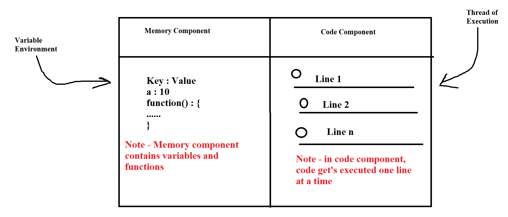
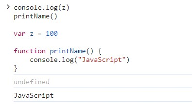

  

 - Javascript is a Synchronous **Single Threaded language**
 - Everything in JS is works under **exection context**.
 - **Execution Context**
    - In exection conext we have **memory exection** phase and **code exection** phase
    - 
  

    - **Example of Execution context**
    - In 1st phase all variables and functions will get allocate with memory special **undefined**
    - In 2nd phase the program will get execute again from top to bottom and now actual memory will get assign to variables and functions
      - 
 

 - After code execution the global execution context gets deleted.
 - Whole Global Execution Context is handle in JavaScript using **CALL STACK**. At the end call stack gets empty.

  
  -  **Hoisting**
     - Hoisting is a phenomenon in JavaScript by which we can access the functions and variable even before we **initialize** them.
     - 
     -  As you can see in above code, we are getting variable z as **undefined** and we are also able to invoke the function.
    
 -   

